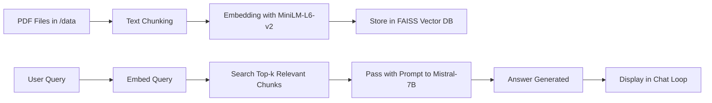

# 🤖 Universal AI Chatbot using RAG + FAISS

A **domain-adaptable AI chatbot framework** built using **Retrieval-Augmented Generation (RAG)**, **FAISS**, and **LangChain**, capable of answering questions from **custom document-based knowledge** like cybersecurity books, medical encyclopedias, and more.

This project supports both research (via Jupyter Notebooks) and production deployment (via Python scripts).

---

## 📌 Table of Contents

* [🔍 What is this Chatbot?](#-what-is-this-chatbot)
* [🧠 Key Concepts (RAG, FAISS, etc.)](#-key-concepts-rag-faiss-etc)
* [🛠️ Project Structure](#️-project-structure)
* [⚙️ How It Works](#️-how-it-works-behind-the-scenes)
* [📚 Models Used](#-models-used)
* [🚀 How to Run](#-how-to-run)
* [🪄 Setup Script](#-setup-script)
* [📁 Data & Vectorstore Info](#-data--vectorstore-info)
* [🎓 Use Cases](#-use-cases)
* [🙌 Credits](#-credits)

---

## 🔍 What is this Chatbot?

This is a **plug-and-play AI chatbot engine** capable of retrieving answers from your **own documents**. Currently, it includes:

* 🧑‍💻 **HackerBot** trained on Bug Bounty & Web Hacking books.
* 🏥 **MedicBot** trained on Medical Encyclopedias.
* 🧠 A base Python script (`ChatBot.py`) for creating more bots easily.

> Jupyter chat logs preserve conversations, useful for debugging and audit trails.

---

## 🧠 Key Concepts (RAG, FAISS, etc.)

### 🔁 Retrieval-Augmented Generation (RAG)

Combines **document retrieval** + **LLM generation**:

1. Retrieves the top-k relevant document chunks.
2. Passes them to a language model for generating the final answer.

### 🔍 FAISS (Facebook AI Similarity Search)

A high-performance library for **semantic vector search** using approximate nearest neighbors (ANN).

Used to:

* Store text chunks as embeddings.
* Retrieve the most relevant ones based on query similarity.

### 💡 Semantic Search

Goes **beyond keyword matching**—it uses vector embeddings to find conceptually similar content even if phrased differently.

---

## 🛠️ Project Structure

```
Universal-AI-ChatBot/
│
├── data/                      # Place your PDF datasets here
│   └── Instructions.md        # Instructions for dataset placement
├── vectorstore/              # Stores FAISS + pickle index files
│   └── Instructions.md        # Instructions for vector DB
├── HackerBot.ipynb           # Chatbot trained on Web Hacking books
├── MedicBot.ipynb            # Chatbot trained on Medical encyclopedia
├── ChatBot.py                # General chatbot template (script version)
├── Setup_env.ps1             # PowerShell script to auto-setup environment
├── requirements.txt
└── README.md
```

---

## ⚙️ How It Works (Behind the Scenes)

### 🔸 Step 1: Load and Split PDFs

```python
DirectoryLoader → PyPDFLoader → RecursiveCharacterTextSplitter
```

* All `.pdf` files in `/data/` are extracted and broken into 500-token chunks.
* 50-token overlap helps preserve context across splits.

---

### 🔸 Step 2: Create Embeddings & Store in FAISS

```python
text_chunks → MiniLM Embeddings → FAISS.from_documents()
```

* Each chunk is transformed into a vector using MiniLM.
* FAISS stores them in `/vectorstore/db_faiss/` as `.faiss` and `.pkl`.

---

### 🔸 Step 3: Query Retrieval & Prompt Assembly

```python
User Query → Embed → Top-3 Match → Inject into Prompt
```

* Input is embedded and compared against the FAISS index.
* Top 3 chunks are selected and formatted into a custom prompt.

---

### 🔸 Step 4: Generate Answer via LLM

```python
PromptTemplate + Mistral LLM → Final Answer
```

* The prompt is passed to `mistralai/Mistral-7B-Instruct-v0.3` on HuggingFace.
* It follows strict instruction: “don’t make up answers.”

---

### 🔸 Step 5: Chat Loop (Script Mode)

```python
while True → input() → RetrievalQA → print()
```

* Interactive command-line chatbot runs until user types `Exit the Chatbot`.

---

## 📚 Models Used

### 🧠 `mistralai/Mistral-7B-Instruct-v0.3`

> A lightweight, instruction-tuned 7B parameter model.

* Balances **speed and comprehension**.
* Follows custom prompt instructions like “No small talk.”

**Usage:**

```python
HuggingFaceEndpoint(repo_id="mistralai/Mistral-7B-Instruct-v0.3", ...)
```

---

### 🧬 `sentence-transformers/all-MiniLM-L6-v2`

> Fast & efficient transformer model for semantic embeddings.

* Converts text into high-dimensional vectors.
* Ideal for **document retrieval** and similarity scoring.

**Usage:**

```python
HuggingFaceEmbeddings(model_name="sentence-transformers/all-MiniLM-L6-v2")
```

---

## 🚀 How to Run

### ▶️ Using Notebooks (Exploratory Mode)

```bash
jupyter notebook HackerBot.ipynb
```

or

```bash
jupyter notebook MedicBot.ipynb
```

### ▶️ Using Python Script (Production Mode)

```bash
python ChatBot.py
```

### ✅ Manual Environment Setup

```bash
python -m venv venv
.\venv\Scripts\activate           # For Windows
pip install -r requirements.txt
```

---

## 🪄 Setup Script

To simplify setup on Windows, run the included PowerShell script:

```powershell
.\Setup_env.ps1
```

This script will:

* Create virtual environment
* Activate it
* Install dependencies silently
* Display success banner ✅

---

## 📁 Data & Vectorstore Info

**Note:** No copyrighted books or embeddings are provided.

Instead:

* `data/Instructions.md`: Add your own `.pdf` files here.
* `vectorstore/Instructions.md`: Explains how indexes will be **auto-created** when PDFs are processed.

Generated files:

* `index.faiss` — vector similarity data
* `index.pkl` — metadata (e.g., document sources)

---

## 🎓 Use Cases

* 🩺 Medical Bots (trained on medical PDFs)
* 🛡️ Cybersecurity Advisors (for bug bounty, web security)
* 🧠 Legal or Finance Q\&A Assistants
* 📄 Compliance Documentation Bots (ISO, SOC2, GDPR, etc.)
* 📘 Educational Assistants (coursebooks, research guides)

---

## 🔁 Visual Pipeline



---

## 🙌 Credits

> Special Thanks & Shout-out to the community and devs whose work made this possible:

* 🎥 [AIwithHassan on YouTube](https://youtu.be/OP0FYjF-37c?si=HJOGBVR4Izgs_8RM)
* 💻 [GitHub - AIwithhassan/medical-chatbot](https://github.com/AIwithhassan/medical-chatbot)

---

## 🙋 Contribution & Feedback

Feel free to fork, star 🌟, open issues, or contribute new bot variants!

---
